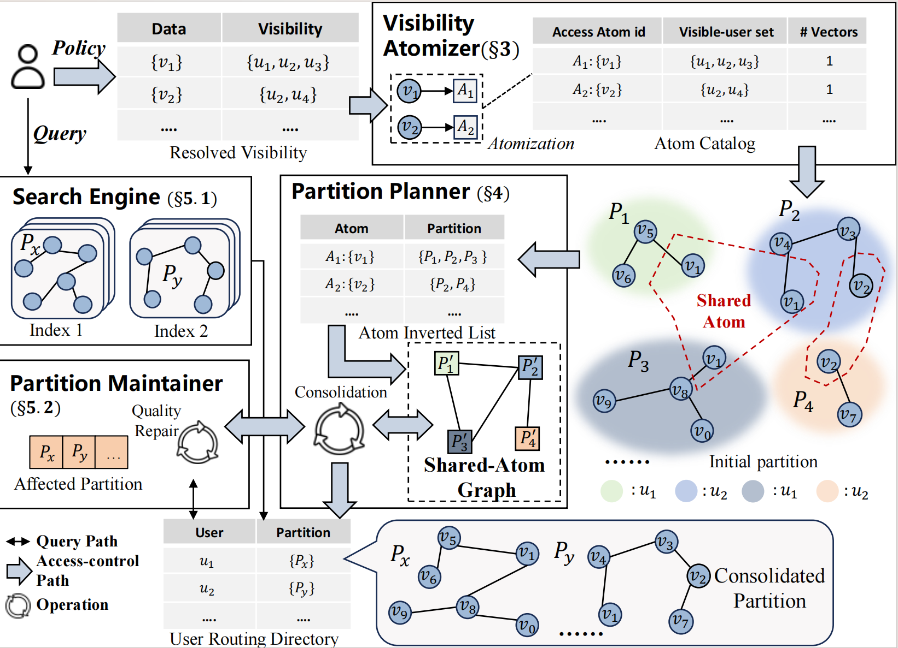

# Store Less, Search Better: Access-Controlled Vector Search over Resolved Visibility[VLDB'27]

We present SQUID, a framework that performs database-internal physical design over resolved visibility for access-controlled vector search.
SQUID groups vectors with the same visible-user set into policy-independent \emph{Access Atoms}.
Starting from a selective per-user seed, its sparse Shared-Atom Graph exposes redundant Atom copies, and its recall-aware cost model ranks their consolidation under a memory budget.
At query time, SQUID allocates partition-specific search effort, filters candidates under current resolved visibility, and merges authorized candidates across routed partitions.
When vectors or visibility change, SQUID preserves query correctness while repairing the affected partitions and indexes.
[Extended Version](https://github.com/zjuDBxAI/SQUID/blob/main/SQUID.pdf)

## Framework



## Prerequisites

- PostgreSQL
- psycopg2

### Clone the Repository

Clone this repository to your local machine.

### Install PostgreSQL 16 or higher and Development Tools
Ensure PostgreSQL and necessary development tools are installed

```sh
sudo apt-get update
sudo apt-get install postgresql postgresql-contrib postgresql-server-dev-all build-essential
```
```shell
sudo apt install libpq-dev
```

### Install and Setup pgvector

The pgvector repository is already included in this project.

**Initial compilation and installation:**
```sh
chmod +x compile_pgvector.sh
./compile_pgvector.sh
```

This will compile pgvector in **debug mode** (`-g -O0`) which is useful for development and debugging.

**After modifying pgvector source code:**
Simply run the compile script again:
```sh
./compile_pgvector.sh
```

Then restart PostgreSQL to load the updated extension:
```sh
sudo service postgresql restart
```

### Setup Database

Start PostgreSQL service:
```sh
sudo service postgresql start
```

Create database user and database with pgvector extension:
```sh
chmod +x setup_db.sh
./setup_db.sh
```

This script will:
- Create superuser `x` with password `123` (or configure your own values in the script)
- Create database `rbacdatabase_treebase`
- Install pgvector extension

**Note**: You may need to modify `setup_db.sh` to match your desired database name, username, and password. Make sure to update `config.json` accordingly.

### Setup Python Environment
Create a virtual environment and install dependencies:

```sh
python3 -m venv venv
source venv/bin/activate
pip install -r requirements.txt
```

### Setup embedding model

```sh
python -m spacy download en_core_web_md
```
## Dataset and workload

### Download Dataset

Download the dataset to {project directory}/dataset/:
```shell
mkdir dataset
cd dataset
sudo apt-get install git-lfs
git lfs install
git clone dataset_link
```
- [wiki-simple](https://huggingface.co/datasets/timescale/wikipedia-22-12-simple-embeddings)
```shell
mkdir dataset
cd dataset
sudo apt-get install git-lfs
git lfs install
git clone https://huggingface.co/datasets/timescale/wikipedia-22-12-simple-embeddings
```

- [SIFT1M features](https://people.otago.ac.nz/xipingfu/SIFT10M.html) (Fu et al.)
  - Download `SIFT1M.tar.gz` and place it in the directory pointed to by `dataset_path` (the template defaults to `dataset`).
  - The loader extracts `SIFT1M/SIFT1Mfeatures.mat` automatically on first run, or you can run  
    `tar -xf SIFT1M.tar.gz SIFT1M/SIFT1Mfeatures.mat`.

### Configure Database Access

Create `config.json` in the repository root and edit it for your PostgreSQL instance:

```json
{
    "dbname": "rbacdatabase_treebase",
    "user": "x",
    "password": "123",
    "host": "localhost",
    "port": "5432",
    "dataset_path": "dataset",
    "use_gpu_groundtruth": false,
    "maintenance_work_mem_gb": 1,
    "max_parallel_maintenance_workers": 1
}
```

**Configuration Options:**
- `use_gpu_groundtruth`:
  - `false` (recommended): Use PostgreSQL for ground truth computation. Slower but no setup required.
  - `true`: Use FAISS GPU for ground truth computation. First run is slow (builds indexes), subsequent runs are much faster.

`DBNAME`, `DB_USER`, `DB_PASSWORD`, `DB_HOST`, `DB_PORT`, `DATASET_PATH`, `MAINTENANCE_WORK_MEM_GB`, and `MAX_PARALLEL_MAINTENANCE_WORKERS` override the corresponding JSON values when set.

If you use the unmodified `setup_db.sh`, the matching defaults are user `x`, password `123`, and database `rbacdatabase_treebase`.

### Prepare Data
```sh
# Load the default Wikipedia dataset
python3 basic_benchmark/common_prepare_pipeline.py --dataset wikipedia-22-12

# Example: load the SIFT 1M benchmark vectors (load-number 0 loads the entire file)
python3 basic_benchmark/common_prepare_pipeline.py --dataset sift-128-euclidean --load-number 0

comming soon

# Flags:
#   --dataset       One of {wikipedia-22-12, YFCC, sift1M}
#   --load-number   Number of rows to ingest (0 or negative means “all remaining rows”)
#   --start-row     Offset within the dataset before loading
#   --num-threads   Worker processes used for ingestion (defaults to CPU count)

```

### Generate Permission
```sh
python3 services/rbac_generator/store_tree_based_rbac_generate_data.py
```
### Generate Query Workload
```sh
python3 basic_benchmark/generate_queries.py --num_queries 1000 --topk 100 --num_threads 4
python3 basic_benchmark/compute_ground_truth.py
```

## Evaluation
### Bash Experiment Entrypoints

- `basic_benchmark/script/treebase.sh`, `uniform.sh`, and `erbac.sh` prepare RBAC data, queries, and selected baseline layouts. Set their `PROJECT_ROOT` and `PYTHON_BIN` values for the local environment.
- `basic_benchmark/script/run_baseline.sh` sweeps EF values over existing layouts and writes logs below `efs_logs/`.
- `basic_benchmark/script/run_ours.sh` and `basic_benchmark/script/run_veda_efs.sh` are dedicated EF sweeps for SQUID and VEDA/EFFVEDA, respectively.
- `basic_benchmark/script/run_memory_sweep.sh` runs the memory-amplification study.
- `basic_benchmark/script/run_updates.py` executes JSON/JSONL incremental-update workloads against the current SQUID layout.
- `basic_benchmark/script/squid/run_versioned_qps.sh` builds and/or evaluates versioned plans through `basic_benchmark/direct_pg_qps.py`.
  
### Build Current Partition plan

Build partitions before query-time or QPS experiments. The unified current-layout entrypoint is `basic_benchmark/script/squid/build_current_partitions.py`. Its `--methods` list accepts `rls`, `role`, `honeybee`/`anonysys`, `hqi`/`qdtree`, `ours`/`squid`, `veda`, and `effveda`. `USER` is intentionally not included in this unified path.

For the ordinary HNSW comparison, explicitly build SQUID and VEDA with `hnsw` too:

```sh
python3 basic_benchmark/script/squid/build_current_partitions.py \
  --methods rls role honeybee hqi ours veda effveda \
  --memory-ratio 1.5 --ef-search 100 \
  --ours-index-type hnsw --veda-index-type hnsw
```

Build only the plans required for a specific experiment when appropriate:

```sh
python3 basic_benchmark/script/squid/build_current_partitions.py \
  --methods ours --memory-ratio 1.5 --ours-index-type hnsw
python3 basic_benchmark/script/squid/build_current_partitions.py \
  --methods effveda --memory-ratio 1.5 --veda-index-type hnsw
```

`squidhnsw` and `vedahnsw` are optimized-index experiments. Build and test them explicitly rather than mixing them with HNSW-baseline results:

```sh
python3 basic_benchmark/script/squid/build_current_partitions.py \
  --methods ours effveda --memory-ratio 1.5 \
  --ours-index-type squidhnsw --veda-index-type vedahnsw
```

For a versioned/materialized plan, use the matching builder. Specify `hnsw` when producing an HNSW version:

```sh
python3 basic_benchmark/script/squid/build_versioned_plan.py \
  --method ours --memory-ratio 1.5 --version ours_1p5 \
  --ours-index-type hnsw
```

**Ground Truth Caching:**
- Ground truth results are automatically cached in `basic_benchmark/ground_truth_cache.json`
- Subsequent test runs with the same queries will load from cache (instant)
- Cache is automatically cleared when regenerating queries with `generate_queries.py`
- To manually clear cache: `rm basic_benchmark/ground_truth_cache.json`

### Query-Time Benchmark

Run all commands from the repository root. `basic_benchmark/test_all.py` is the basic **query-time** benchmark: it runs the generated workload, records recall and per-query latency, and reports storage for each EF setting. SQUID and VEDA tests reuse the layouts built above; they do not materialize partitions themselves.

```sh
python3 basic_benchmark/test_all.py --algorithm RLS --efs 500
python3 basic_benchmark/test_all.py --algorithm ROLE --efs 20
python3 basic_benchmark/test_all.py --algorithm AnonySys --efs 40
python3 basic_benchmark/test_all.py --algorithm QDTree --efs 40

python3 basic_benchmark/test_all.py --algorithm OURS --efs 20
python3 basic_benchmark/test_all.py --algorithm EFFVEDA --efs 100
```

`test_all.py` defaults to `--index-type hnsw` for every method. Use an optimized variant only after building its matching optimized layout:

```sh
python3 basic_benchmark/test_all.py --algorithm OURS --efs 20 --index-type squidhnsw
python3 basic_benchmark/test_all.py --algorithm EFFVEDA --efs 100 --index-type vedahnsw
```

### QPS Benchmark

`basic_benchmark/direct_pg_qps.py` measures throughput under concurrent PostgreSQL clients. Its default `--index-mode hnsw` uses the same HNSW layouts as the query-time benchmark.

```sh
python3 basic_benchmark/direct_pg_qps.py \
  --methods rls role honeybee hqi ours veda effveda \
  --query-count 200 --query-repetitions 5 --concurrency 64 \
  --ef-search 100 --index-mode hnsw --auth-filter rls
```

Results are written under `basic_benchmark/result/direct_pg_qps/`. For a repeatable build-and-QPS sweep, use the wrapper:

```sh
PLAN_MODE=current BUILD=true QPS=true METHODS="ours effveda" \
  EF_VALUES="100" bash basic_benchmark/script/squid/run_versioned_qps.sh
```

Use `--index-mode native` only for the optimized-index experiment. OURS/VEDA native mode requires layouts built with `squidhnsw`/`vedahnsw` and `--auth-filter native`.

### Update Operations

Incremental updates run against an already materialized current SQUID layout. Use `basic_benchmark/script/run_updates.py` with a JSON object, JSON array, or JSONL workload. The runner groups consecutive document/vector/ACL records into `--batch-size` maintenance batches, while `role_insertion` and `role_deletion` run in workload order as separate operations.

Document operations include `insert`, `upsert`, `delete`, `vector_update`, `acl_update`, `acl_grant`, and `acl_revoke`. Role records require `role_id` and `user_ids`; `role_insertion` also requires `document_ids`.

```sh
cat > update_workload.jsonl <<'EOF'
{"operation":"acl_grant","document_id":1,"role_ids":[1001]}
{"operation":"acl_revoke","document_id":2,"role_ids":[1002]}
{"operation":"role_insertion","role_id":2001,"document_ids":[3,4],"user_ids":[3001,3002]}
{"operation":"role_deletion","role_id":2001,"document_ids":[3,4],"user_ids":[3001,3002]}
EOF

# Validate workload shape and batches without modifying PostgreSQL.
python3 basic_benchmark/script/run_updates.py \
  --workload update_workload.jsonl --batch-size 32 --dry-run

# Run the update experiment against the current SQUID layout.
python3 basic_benchmark/script/run_updates.py \
  --workload update_workload.jsonl --batch-size 32 --index-type hnsw
```

Results are written under `basic_benchmark/result/updates/` by default; use `--output path/to/result.json` to choose a file. The runner applies real database changes, so use disposable benchmark data or reset the database between trials.


### Run the ACORN Benchmark
```sh
cd acorn_benchmark

# Adjust the ef_search value in main.cpp, then build and run the C++ project.
```

Before building, create `acorn_benchmark/config.json` to point benchmarks at the shared index location:

```json
{
    "index_storage_path": "/pgsql_data/acorn/"
}
```

Make sure `/pgsql_data/acorn/` exists ahead of time; both ACORN and dynamic-partition indexes are persisted there.

## Acknowledgements
The code implementation and README structure of this project are referenced from the open-source repository [rjzhb/VectorSearch-RBAC](https://github.com/rjzhb/VectorSearch-RBAC). We thank the original author Hongbin Zhong for his work.
